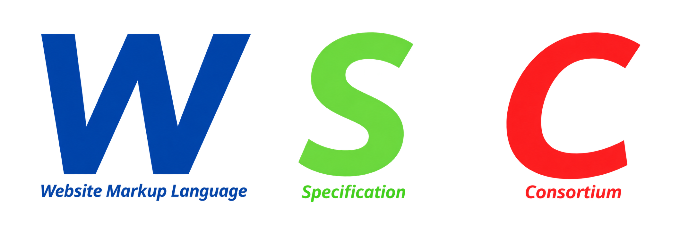

<div align="center">
 
 <h1> Website Markup Language Specification Consortium </h1>
</div>

[Homepage](index.md) | [About WSC](info.md) | [Drafts](drafts.md) | [Languages](languages.md) | [Staff](staff.md)

## About Us
The Website Markup Language Specification Consortium (WSC) is an independent standards body 
that maintains and evolves the WML (Website Markup Language) specification. WSC is not affiliated 
with, derived from, or governed by the World Wide Web Consortium (W3C) — it is a distinct organization, 
though WML's technical foundation credits the original HTML 4.01 DTD and its authors as prior art. WSC 
is part of the broader WML Family of specifications, and remains committed to SGML and XML as the underlying 
grammar for all WML documents.

WSC believes that web standards should be accessible to everyone — not just industry professionals. 
By maintaining a strict, clean specification built on proven technologies, WSC provides a foundation 
for developers who value clarity, structure, and semantic correctness over experimental features. 
WML reflects this philosophy: simple enough for beginners, rigorous enough for production use.

## About WML
WML (Website Markup Language) is a strict, XML-based markup language for creating structured web documents. 
Built upon the foundation of HTML 4.01 Strict, WML enforces clean syntax, semantic elements, and a clear 
separation of content from presentation. Every WML document must be well-formed, fully compliant with XML rules, 
and validated against the official WML 1.0 DTD *(coming soon)* maintained by the WSC. By combining the rigor of SGML with the 
simplicity of modern web practices, WML offers developers a disciplined, predictable, and future-proof approach 
to web authoring — one that prioritizes readability, accessibility, and long-term maintainability over experimental 
or vendor-specific features.

**Specs**

| Feature | Details |
|---------|---------|
| Based On | HTML 4.01 Strict |
| Grammar | SGML / XML |
| Version | 0.4 Draft |
| Maintained By | WSC (Website Markup Language Specification Consortium) |
| File Extension | `.wml` |
| MIME Type | `text/wml` |
| DOCTYPE | `<!DOCTYPE WML PUBLIC "-//WSC//DTD WML Alpha 0.4//EN" "wml-rules.dtd">` |

## Sample Use
```xml
<?xml version="1.0" encoding="UTF-8"?>
<!DOCTYPE wml PUBLIC "-//WML//DTD WML Alpha 0.4//EN" "wml-rules.dtd">
<wml version="0.4">
  <head>
    <meta charset="UTF-8"/>
  </head>
  <body>
    <h1>Hello, World</h1>
    <p>This is my First Website in WML!</p>
  </body>
</wml>
```

> **New to WML?** Check out the [Getting Started Guide](getting-started.md) to write your first WML document.

---
*© 2026 Website Markup Language Specification Consortium. WML™ is an unofficial mark of WSC.*